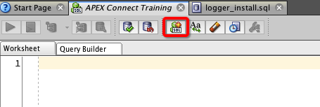

# Logger Workshop: Advanced Topics

Logger has a lot of great tools included with it. Unfortunately most people don't know about them. This section will cover these topics.

## Session Specific Logging

So far you've been shown how to change the logging level by using `logger.set_level`. From the past demos this changes the level for the entire schema using Logger. In most organizations Logger is set to `debug` in Dev and Test environments, and `error` in UAT and Prod environments.

What happens when something is going wrong in Production? In the past the only way to get more detailed information is to change the level to `debug`. This is not a suitable solution for very large applications with many users. Setting to `debug` may slow down the production environment.

The solution is called Session Specific Logging. Session specific logging allows you to change the level for a specific session without modifying that user's session a all. The way this is done is by leveraging a session's `client identifier` or `client_id`.

### Exercise

The following exercise will show how to change a session's logging level while not affecting any other session on the system. _Be sure to follow the steps carefully!_

In your worksheet in SQL Developer, run the following:

```sql
exec logger.set_level(logger.g_debug);

exec logger.log('Session-1: this should show up');

select id, logger_level, text, client_identifier, call_stack
from logger_logs_5_min
order by id desc;
```

You'll notice that the message was logged successfully.

Next run:

```sql
begin
  logger.set_level (logger.g_error);
  logger.log('Session-1: this should NOT show up');
  logger.log_error('Session-1: this error message should show up');
end;
/


select id, logger_level, text, client_identifier, call_stack
from logger_logs_5_min
order by id desc;
```

Only the second message should be logged.

**Open a new, unshared, worksheet**. Note a unshared worksheet is a new connection to the database and is separate from any open worksheets. To open it click on the highlighted icon. This will be called `Worksheet 2`.



Run the following code in both worksheets.

Worksheet 1 (WS1) | Worksheet 2 (WS2)
--- | ---
`exec logger.set_level (logger.g_error);` |
 | `exec dbms_session.set_identifier('my_identifier');`
Set the level only for `WS2` in `WS1`. </br>  `exec logger.set_level(logger.g_debug,'my_identifier');` |
Note that the level was changed from `WS1` for `WS2` without modifying anything in `WS2`'s session |
`exec logger.log('WS1 - should not log');` |
 | `exec logger.log('WS2 - should log');`
Query `logger_logs_5_min` to see what was stored. |

You can use this vary basic example to configure session specific logging, just don't forget to set the client identifier in each session (`dbms_session.set_identifier`).

A few things to note:
- In APEX, the client identifier is already set to `:APP_USER || ':' || :APP_SESSION`
- [logger.set_level documentation](https://github.com/OraOpenSource/Logger/blob/master/docs/Logger%20API.md#set_level)
- By default, any session specific configurations will expire after 12 hours. This is configurable both as a preference and as parameter.
- To unset a session run `logger.unset_client_level(p_client_id);`


## `ok_to_log`

In some situations you may have a block of "expensive" code that is meant just for logging. An example is if you need to dump an array of data into the logs. In these situations you know ahead of time that the only reason this block of code is run is for logging purposes.

[`logger.ok_to_log`](https://github.com/OraOpenSource/Logger/blob/master/docs/Logger%20API.md#ok_to_log) is used to determine if any calls to logger will be logged. It is not used often but is very useful when necessary.

### Exercise

Run the following code and look at the logs that are stored. Change the level from `debug` to `error`, run again, and see what happens.

```sql
declare
  type emp_tab is table of emp%rowtype;
  l_emps emp_tab;
  l_scope logger_logs.scope%type := 'ok_to_log';
begin

  select e.*
  bulk collect into l_emps
  from emp e;

  if logger.ok_to_log(p_level => logger.g_debug) then
    for i in 1..l_emps.count loop
      logger.log('i: ' || l_emps(i).ename || ' ' || l_emps(i).sal, l_scope);
    end loop;
  end if;

end;
/
```


## Timers

If comparing the time code takes to run, Logger has some [timer procedures](https://github.com/OraOpenSource/Logger/blob/master/docs/Logger%20API.md#timing-procedures).

_Currently it's not recommended to leave this in packaged code, rather in anonymous blocks used to test calling procedures. We hope to change the timing structure in the future._

### Example

Run the following code and then look at the logs to see the output.

```sql
declare
    l_number number;
begin

  logger.set_level(logger.g_debug);

  logger.time_reset;
  logger.time_start('foo');

  logger.time_start('bar');
  for i in 1..500000 loop
    l_number := power(i,15);
    l_number := sqrt(1333);
  end loop; --i
  logger.time_stop('bar');

  for i in 1..500000 loop
    l_number := power(i,15);
    l_number := sqrt(1333);
  end loop; --i

  logger.time_stop('foo');
end;
/
```

Now alter the above code to add another timer inside the `bar` loop (right before `logger.time_stop('bar');`), then view the output. Notice how Logger indents the timing messages.
