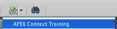

# Logger Workshop: Introduction

Open a new worksheet in SQL Developer.



## Install Logger

Logger can be downloaded from the project’s home page: [https://github.com/OraOpenSource/logger](https://github.com/OraOpenSource/logger) To help with any connection issues a copy of the latest version, 3.1.1, is included with this course in `/software/logger_3.1.1/`.

To install Logger, drag & drop `logger_install.sql` into the new worksheet in SQL Developer. Hit `F5` to run the script. If everything works well you should see the following at the end of the script output:

```sql
Project Home Page        : https://github.com/oraopensource/logger/
Logger Version           : 3.1.1
Debug Level              : DEBUG
Capture Call Stack       : TRUE
Protect Admin Procedures : TRUE
APEX Tracing             : Enabled
SCN Capture              : Disabled
Min. Purge Level         : DEBUG
Purge Older Than         : 7 days
Pref by client_id expire : 12 hours
For all client info see  : logger_prefs_by_client_id

*************************************************

PL/SQL procedure successfully completed.
```

## Hello World

Logging information is as simple as `logger.log('hello world');`. Try it out and see the result.

```sql
declare
begin
  logger.log('Hello World');
end;
/
```

## Querying Logger

The easiest way to see what's in Logger is to query the `logger_logs` table which will return all the records in the log table.

```sql
select *
from logger_logs
order by id desc;
```

You should notice quite a lot of information that is stored from a very basic call that was done in the `Hello World` example.

You usually only need to see recent logs and as such the following query will be used throughout the rest of the workshop:

```sql
select *
from logger_logs_5_min
order by id desc;
```

As the view's name suggest, it will return the last 5 minutes worth of logs.

It is recommended to sort by `id desc` so that you see the most recent information first. Initially this can be confusing since you need to get used to "reading the logs backwards" but once you get used it you will find it easy.
